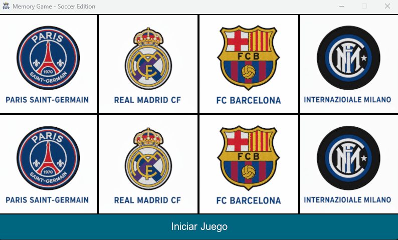

[](README.es.md)

# 🃏 Memory Game - Soccer Edition


A fully functional **Soccer-themed Memory Card Game** developed with **Pygame**. This project demonstrates video game programming concepts including grid layouts, event handling, state management, and interactive game mechanics.

---

## 🎬 Preview

<div align="center">
  
</div>

---

## 👨‍🎓 Developer Info

- **Author:** Carlos Gabriel Magallanes López
- **Email:** cgmagallanes23@gmail.com
- **Development Date:** October 15, 2025

---

## 🎮 Game Description

This is a classic Memorama game featuring soccer team logos. Players must find matching card pairs by flipping two at a time. The game includes:

- **Grid layout** with 8 cards (4 pairs) arranged in a 2×4 grid
- **Card flip mechanics** with smooth reveal animations
- **Pair detection system** for matched cards
- **Auto-hide functionality** for non-matching pairs
- **Win detection** when all pairs are found
- **Card randomization** for replayability
- **Interactive start button** to begin new games

---

## 🎯 Game Mechanics

### Controls

| Control | Action |
|---------|--------|
| **Mouse Click** | Select and flip cards |
| **Start Button** | Begin a new game with shuffled cards |

### Objective
Find all 4 soccer team card pairs by remembering their positions. Cards flip back if they don't match.

### Game Rules
1. Click the "Start Game" button to begin
2. Click any card to reveal it
3. Click a second card to try to find a match
4. If the cards match, they stay revealed
5. If they don't match, they flip back after 1 second
6. Continue until all pairs are found
7. The game resets automatically when you win

---

## 🚀 Features

### ✨ Core Game Features
- **Card Grid System:** 2×4 grid layout with 4 unique soccer team logos
- **Pair Detection:** Automatic comparison of selected cards
- **Timed Reveal:** Unmatched cards hide after 1 second
- **Win Condition:** Automatic win detection and game reset
- **Card Shuffle:** Random positions at game start
- **State Management:** Tracking of revealed and discovered cards

### 🎨 Visual Elements
- **Soccer Team Logos:** PSG, Real Madrid, Barcelona, and Inter Milan
- **Card Back Design:** Clean grey design for hidden cards
- **Border Highlight:** Black borders around each card
- **Start Button:** Green button that turns white during gameplay
- **Smooth Rendering:** 60 FPS gameplay

### 🎮 Interactive Elements
- **Click Detection:** Precise mouse position tracking
- **Button States:** Visual feedback for the start button
- **Card States:** Three states (hidden, shown, discovered)
- **Turn Lock:** Prevents clicks during card comparison

---

## 🔧 Technical Implementation

### Game Architecture

```python
# Main Components:
1. Card Class (Object-Oriented Design)
2. Screen Setup (Pygame Window)
3. Grid Layout System (2D Array)
4. Event Handling Loop
5. State Management
```

### Data Structures
```python
# Card states
hidden    → Grey rectangle (not yet flipped)
shown     → Team logo visible (being compared)
discovered → Team logo permanently visible (matched)

# Game states
not_started → Waiting for start button
playing     → Active game session
won         → All pairs found, auto-reset
```

### Key Algorithms

#### Card Shuffle
```python
Random Shuffle Algorithm:
- Generate random positions for all 8 cards
- Swap cards to randomize placement
- Guarantees fair distribution each game
```

#### Timed Hide Logic
```python
Delayed Hide Mechanic:
- Record time.time() when second card is flipped
- Check elapsed time each frame
- Hide after 1 second if no match
- Non-blocking implementation
```

---

## 🎨 Visual Design

### Color Palette

| Element | Color | Hex |
|---------|-------|-----|
| **Background** | White | `#FFFFFF` |
| **Card Back** | Grey | `#CECECE` |
| **Card Border** | Black | `#000000` |
| **Start Button (Active)** | Green | `#00FF00` |
| **Start Button (Playing)** | White | `#FFFFFF` |
| **Button Text** | Dynamic | White/Grey by state |

### Card States
1. **Hidden:** Grey rectangle with black border
2. **Shown:** Team logo visible
3. **Discovered:** Team logo permanently visible

---

## 📊 System Requirements

| Component | Requirement |
|-----------|-------------|
| **OS** | Windows 7 / 8 / 10 / 11 |
| **RAM** | 2 GB |
| **Storage** | ~50 MB free space |
| **Dependencies** | None — bundled in executable |

---

## 📥 Download & Run

### Quick Start — No Installation!

The game is available as an executable — **no Python or dependencies required**.

1. **Download** the `.exe` from [Releases](https://github.com/TheNarratorVIMMXX/SoccerCards/releases)
2. **Double-click** the `.exe` file
3. **Play immediately** — no setup or configuration needed!

---

## 🐛 Known Limitations

- Fixed window size of 800×450 (not resizable)
- Only 4 card pairs (8 total)
- No scoring system or timer
- No difficulty levels

---

## 📚 Learning Outcomes

This project serves as an educational resource for understanding fundamental video game development concepts:

### 🎓 What You'll Learn

1. **Object-Oriented Programming**
   - Class design and encapsulation
   - Instance attributes and methods
   - Object state management
   - Type hints and validation

2. **Pygame Fundamentals**
   - Window and display setup
   - Event loop architecture
   - Mouse input handling
   - Surface and image rendering
   - Rectangle-based collision detection

3. **Grid Game Logic**
   - 2D array manipulation
   - Coordinate system conversion
   - Grid traversal algorithms
   - Position-to-index mapping

4. **State Management**
   - Game state tracking (not started, playing, won)
   - Card state machines (hidden, shown, discovered)
   - Turn-based logic implementation
   - Boolean flags for game control

5. **Event-Driven Programming**
   - Mouse click event handling
   - Event processing pipeline
   - Button interaction logic

6. **Timing and Delays**
   - Time-based mechanics with `time.time()`
   - Delayed card hiding
   - Frame rate control with `clock.tick()`
   - Non-blocking delay implementation

7. **Randomization Algorithms**
   - Card shuffling techniques
   - Random position generation
   - Fair distribution guarantee

8. **Game Loop Design**
   - Rendering loop structure
   - Update and render separation
   - FPS management
   - Continuous game state updates

9. **Collision Detection**
   - Point-rectangle collision (`collidepoint`)
   - Grid boundary validation
   - Click area detection

10. **Visual Rendering**
    - Image loading and blitting
    - Rectangle drawing
    - Text rendering
    - Layered rendering order

### 🎯 Skills Developed

By studying and modifying this code, you'll gain hands-on experience with:

✅ **Game design patterns** and architecture  
✅ **Memory management** in memorama-style games  
✅ **User interface design** for grid-based games  
✅ **Input validation** and error handling  
✅ **Algorithm implementation** (shuffling, matching)  
✅ **Code organization** with classes and functions  

This repository is perfect for students learning Pygame, video game development fundamentals, or anyone interested in understanding how classic memory games work programmatically.

---

## 🤝 Contributions

Students and developers are welcome to:
- Report bugs
- Suggest new features or themes
- Submit pull requests with improvements
- Share gameplay strategies
- Add new card themes

---

## 📄 License

This project is educational in nature and available for free use for learning purposes. Soccer team logos are property of their respective owners and are used for educational purposes only.

---

## 📧 Contact

**Carlos Gabriel Magallanes López**  
Email: cgmagallanes23@gmail.com

---

⭐ **If you enjoyed this game or found it educational, give it a star on GitHub!**

**🎮 Have fun playing!**
